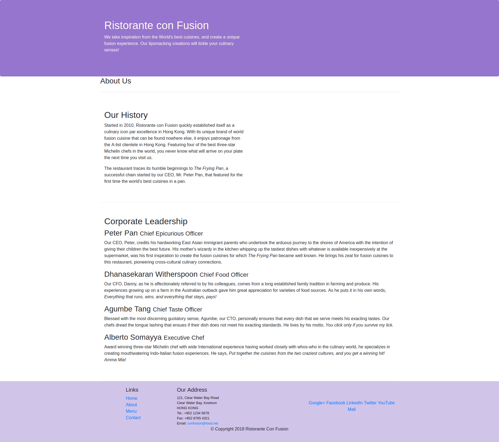

# Full Stack Development 

## Bootstrap 4

---

### Assignment 01: About US

#### Task 01: Apply Bootstrap CSS and JavaScript Classes

Add the following contents at **the beginning of page head** to enable **media query** and **Bootstrap CSS**

```html
    <head>
        <meta charset="utf-8">
        <!-- CSS media query -->
        <meta name="viewport" content="width=device-width, initial-scale=1, shrink-to-fit=no">
        <!-- Windows compatibility -->
        <meta http-equiv="x-ua-compatible" content="ie=edge">

        <!-- Bootstrap CSS -->
        <link rel="stylesheet" href="node_modules/bootstrap/dist/css/bootstrap.min.css">
        <link rel="stylesheet" href="static/css/styles.css">
    </head>
```

And the following contents at **the end of page body** to enable **Bootstrap JSs**

```html
    <body>
        <!-- Bootstrap JSs: jQuery first, then Popper.js, then Bootstrap JS. -->
        <script src="node_modules/jquery/dist/jquery.slim.min.js"></script>
        <script src="node_modules/popper.js/dist/umd/popper.min.js"></script>
        <script src="node_modules/bootstrap/dist/js/bootstrap.min.js"></script>
    </body>
```

#### Task 02: Format Page Contents

For **Our History** section:

```html
<div class="row row-content align-self-center">
    <div class="col-12 col-sm-6">
        <!-- h2>Our History</h2 -->
        <!-- p></p -->
        <!-- p></p -->
    </div>

    <div class="col-12 col-sm">
    </div>
</div>
```

For **Coroporate Leadership** section:

```html
<div class="row row-content align-self-center">
    <div class="col-12">
        <!-- h2>Corporate Leadership</h2 -->
        <!-- h3>Peter Pan <small>Chief Epicurious Officer</small></h3 -->
        <!-- p class="d-none d-sm-block">
        </p -->

        <!-- h3>Dhanasekaran Witherspoon <small>Chief Food Officer</small></h3 -->
        <!-- p class="d-none d-sm-block">
        </p -->

        <!-- h3>Agumbe Tang <small>Chief Taste Officer</small></h3 -->
        <!-- p class="d-none d-sm-block">
        </p -->
        
        <!-- h3>Alberto Somayya <small>Executive Chef</small></h3 -->
        <!-- p class="d-none d-sm-block">
        </p -->
    </div>
</div>
```

#### Task 03: Hide Details on extreme small screem

Add the class **d-none d-sm-block** to all paragraphs in **Corporate Leadership** section:

```html
<div class="row row-content align-self-center">
    <div class="col-12">
        <!-- h2>Corporate Leadership</h2 -->
        <!-- h3>Peter Pan <small>Chief Epicurious Officer</small></h3 -->
        <p class="d-none d-sm-block">
        </p>

        <!-- h3>Dhanasekaran Witherspoon <small>Chief Food Officer</small></h3 -->
        <p class="d-none d-sm-block">
        </p>

        <!-- h3>Agumbe Tang <small>Chief Taste Officer</small></h3 -->
        <p class="d-none d-sm-block">
        </p>
        
        <!-- h3>Alberto Somayya <small>Executive Chef</small></h3 -->
        <p class="d-none d-sm-block">
        </p>
    </div>
</div>
```

#### Demo

Target page on extreme small device:


Target page from small device:


